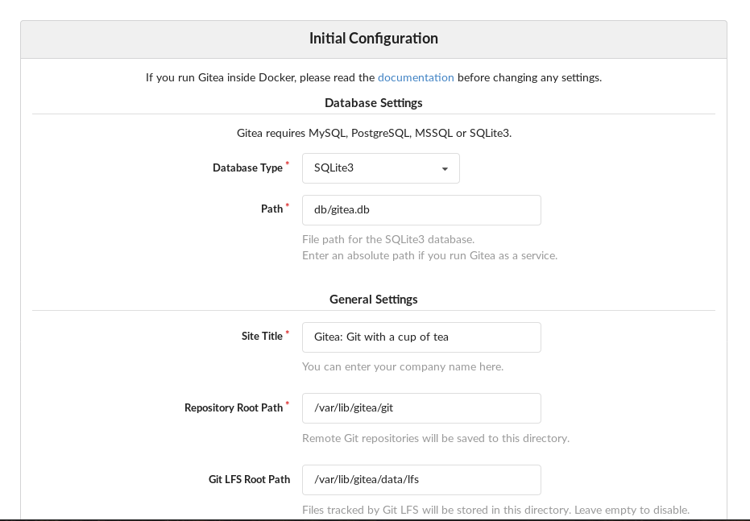

# Gitea: Git with a cup of tea

Gitea seems like a good candidate for a selfhosted variant of GitHub, so why
not host it in a squashfs image ... :)

Add `app.ini` in `/etc/gitea` on the host you'll run Gitea.

To build the image run `build.sh` and that should be it.

## Installation

Gitea has a web UI installer to set up the database and the filesystem
structure. Couldn't find a cli that does it, it's a bit cumbersome to do it
through the web UI, but here goes.

1. Comment the `INSTALL_LOCK   = true` variable in /etc/gitea/app.ini, or set
   it to `false`.

2. Open http://localhost:3000/install and set all configuration to match the
   one in /etc/gitea/app.ini. The image below matches the config from this
   repo.

   

   You will get an error:

   ```
   Failed to save configuration: open /etc/gitea/app.ini: permission denied
   ```

3. Profit! The filesystem and db are all set up, you can ignore the permission
   error.

4. **YOU'LL NEED TO UPDATE** `INSTALL_LOCK = true` in app.ini to continue using
   Gitea without being redirected to /install.


## TODO

* Instructions for setting up SSH with Gitea's built-in SSH server and the SSH
  server running on the host.
* Real world configuration.
